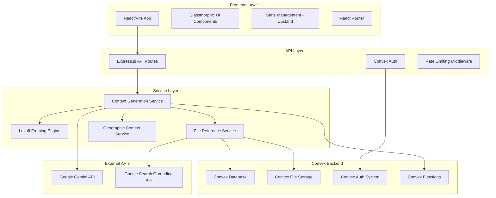

# Design Document

## Overview

The EA PolicyFrame App is a modern web application built with a React/Vite frontend and Express.js backend, featuring a glassmorphic design system that integrates multiple AI models for content generation. The application combines George Lakoff's cognitive framing principles with marketing philosophies from Seth Godin, Gary Vaynerchuk, and Kieran Flanagan to create strategically framed AI policy content.

The system architecture supports real-time content generation, secure API management, file reference integration, and multi-regional policy adaptation through a modular, scalable design that prioritizes user experience and content quality.

## Architecture

### High-Level Architecture



### Technology Stack

**Frontend:**
- React 18.3+ with TypeScript
- Vite 5.3+ for build tooling and development
- Tailwind CSS 3.4+ for styling
- Zustand 4.5+ for state management
- React Hook Form 7.52+ for form handling
- Framer Motion 11.3+ for animations
- React Router 6.24+ for client-side routing

**Backend:**
- Express.js 4.19+ with Node.js 20+
- Convex 1.13+ for database, authentication, and file storage
- Convex Auth for user management and authentication
- Convex File Storage for document and media handling

**External Integrations:**
- Google Gemini API (2.5-pro, 2.5-flash, gemma-3-12b-it)
- Google Search Grounding API

## Components and Interfaces

### Core Components

#### 1. Content Generation Engine

**Purpose:** Orchestrates the entire content generation workflow from input validation to final output.

**Key Methods:**
```typescript
interface ContentGenerationEngine {
  generateContent(request: ContentRequest): Promise<ContentResponse>
  validateInput(input: UserInput): ValidationResult
  applyGeographicContext(content: string, region: Region): string
  streamResponse(generator: AsyncGenerator): ReadableStream
}
```

**Responsibilities:**
- Input validation and preprocessing
- Model selection and optimization
- Content streaming and progress tracking
- Error handling and fallback management

#### 2. Lakoff Framing Engine

**Purpose:** Applies George Lakoff's cognitive framing principles to transform content using positive, value-based language.

**Key Methods:**
```typescript
interface LakoffFramingEngine {
  analyzeFraming(content: string): FramingAnalysis
  reframeContent(content: string, targetFrame: Frame): string
  extractMetaphors(text: string): Metaphor[]
  avoidNegativeFrames(content: string): string
}
```

**Framing Strategies:**
- Conceptual metaphor identification and replacement
- Positive frame reinforcement
- Value-based language optimization
- Opposition frame avoidance

#### 3. File Reference Service

**Purpose:** Manages document storage, search, and content extraction from both local and cloud sources.

**Key Methods:**
```typescript
interface FileReferenceService {
  searchDocuments(query: string): Document[]
  extractContent(documentId: string): DocumentContent
  findRelevantExamples(topic: string): Example[]
  generateCitations(documents: Document[]): Citation[]
}
```

**Storage Integration:**
- Convex database for file metadata and content
- Convex File Storage for document handling
- Full-text search capabilities
- Semantic search using embeddings

#### 4. Geographic Context Service

**Purpose:** Provides region-specific policy context and cultural adaptation for content generation.

**Key Methods:**
```typescript
interface GeographicContextService {
  getRegionalContext(region: Region, topic: string): RegionalContext
  adaptCulturalReferences(content: string, region: Region): string
  getPolicyFramework(region: Region): PolicyFramework
  getRecentDevelopments(region: Region): PolicyUpdate[]
}
```

**Regional Specializations:**
- USA: Federal and state AI initiatives, regulatory landscape
- Europe: GDPR compliance, AI Act implementation
- Australia: AI governance frameworks, digital strategy
- Morocco: Digital transformation initiatives, AI strategy development

### User Interface Components

#### 1. Glassmorphic Design System

**Core Styles:**
```css
.glass-card {
  backdrop-filter: blur(20px);
  background: rgba(255, 255, 255, 0.1);
  border-radius: 16px;
  border: 1px solid rgba(255, 255, 255, 0.2);
  box-shadow: 0 8px 32px rgba(0, 0, 0, 0.1);
}

.glass-button {
  backdrop-filter: blur(20px);
  background: linear-gradient(135deg, #667eea 0%, #764ba2 100%);
  border-radius: 12px;
  min-height: 44px;
  min-width: 44px;
}
```

**Component Library:**
- GlassCard: Primary container component
- GlassButton: Interactive elements
- GlassInput: Form inputs with glassmorphic styling
- GlassModal: Overlay dialogs
- GlassNavigation: Navigation components

#### 2. Screen Layouts

**Landing Screen:**
- Hero section with app introduction
- Topic input field with URL option
- Geographic selector (USA, Europe, Australia, Morocco)
- Four content type cards with glassmorphic styling

**Generation Dashboard:**
- Model selection interface
- Progress indicators with streaming updates
- Real-time content preview
- Generation controls and settings

**Output Display:**
- Formatted content presentation
- Export options (PDF, Word, HTML)
- Sharing and collaboration tools
- Version history and editing capabilities

**Settings Screen:**
- Secure API key management
- Model preferences and optimization
- Usage monitoring and analytics
- Account and profile management

**Content Library:**
- Organized content repository
- Search and filtering capabilities
- Archive and organization tools
- Performance analytics

## Data Models

### Core Data Structures

#### User Model
```typescript
interface User {
  id: string
  email: string
  name: string
  preferences: UserPreferences
  apiKeys: EncryptedApiKeys
  usage: UsageMetrics
  createdAt: Date
  updatedAt: Date
}
```

#### Content Model
```typescript
interface GeneratedContent {
  id: string
  userId: string
  type: ContentType
  topic: string
  region: Region
  model: GeminiModel
  content: string
  metadata: ContentMetadata
  citations: Citation[]
  createdAt: Date
  updatedAt: Date
}
```

#### Document Model
```typescript
interface Document {
  id: string
  title: string
  content: string
  metadata: DocumentMetadata
  storageId: string // Convex file storage ID
  extractedMetaphors: Metaphor[]
  framingExamples: FramingExample[]
  createdAt: Date
}
```

### Database Schema

**Convex Database:**
- Users table with Convex Auth integration
- Generated content with full-text search capabilities
- Document metadata and content storage
- Usage analytics and performance metrics
- File storage with automatic CDN distribution

**Convex Features:**
- Real-time data synchronization
- Automatic backup and versioning
- Built-in authentication and authorization
- Serverless functions for business logic
- File upload and storage with CDN

## Error Handling

### Error Categories and Responses

#### API Errors
- **Rate Limiting:** Graceful degradation with retry mechanisms
- **Authentication Failures:** Clear messaging with resolution steps
- **Model Unavailability:** Automatic fallback to alternative models
- **Quota Exceeded:** Usage alerts with upgrade options

#### Content Generation Errors
- **Input Validation:** Real-time feedback with correction suggestions
- **Processing Failures:** Partial content recovery and retry options
- **Framing Conflicts:** Alternative framing suggestions
- **Citation Errors:** Manual citation options with templates

#### System Errors
- **Network Issues:** Offline mode with local caching
- **Storage Failures:** Backup and recovery mechanisms
- **Performance Issues:** Progressive loading and optimization
- **Security Violations:** Immediate lockdown with audit logging

### Error Recovery Strategies

1. **Graceful Degradation:** Maintain core functionality during partial failures
2. **Automatic Retry:** Intelligent retry mechanisms with exponential backoff
3. **User Notification:** Clear, actionable error messages with resolution steps
4. **Fallback Options:** Alternative approaches when primary methods fail
5. **Data Recovery:** Comprehensive backup and restoration capabilities

## Testing Strategy

### Testing Pyramid

#### Unit Tests (70%)
- Individual component functionality
- Framing engine algorithms
- Data model validation
- Utility function verification

#### Integration Tests (20%)
- API endpoint functionality
- Database operations
- External service integration
- Authentication workflows

#### End-to-End Tests (10%)
- Complete user workflows
- Cross-browser compatibility
- Mobile responsiveness
- Performance benchmarks

### Testing Tools and Frameworks

**Frontend Testing:**
- Jest for unit testing
- React Testing Library for component testing
- Playwright for E2E testing
- Storybook for component documentation

**Backend Testing:**
- Jest for API testing
- Supertest for HTTP testing
- SQLite in-memory for database testing
- Mock services for external APIs

### Performance Testing

**Metrics to Monitor:**
- Content generation response times
- API rate limiting effectiveness
- Database query performance
- Frontend rendering performance
- Mobile device compatibility

**Testing Scenarios:**
- Concurrent user load testing
- Large document processing
- Extended content generation sessions
- Network connectivity variations
- Device performance across different hardware

### Security Testing

**Security Measures:**
- API key encryption validation
- Authentication bypass attempts
- Input sanitization verification
- HTTPS enforcement testing
- Data privacy compliance checks

**Penetration Testing:**
- SQL injection prevention
- XSS attack mitigation
- CSRF protection validation
- Session management security
- Data transmission encryption